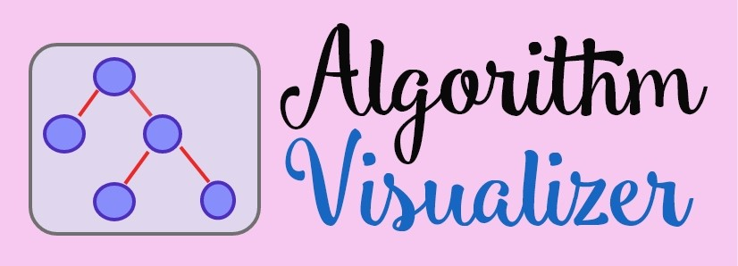
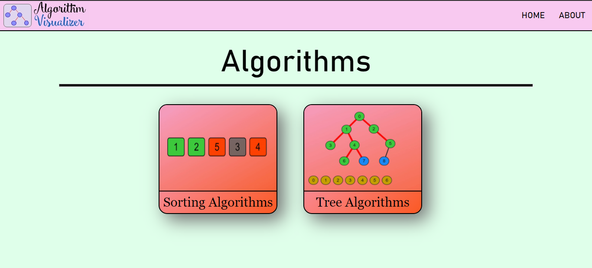
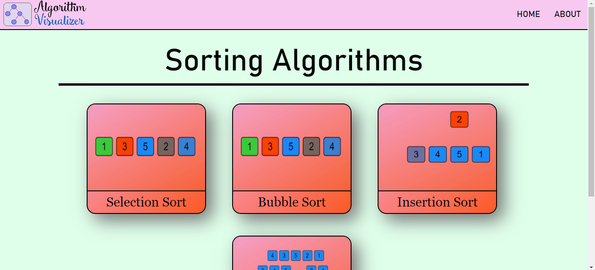
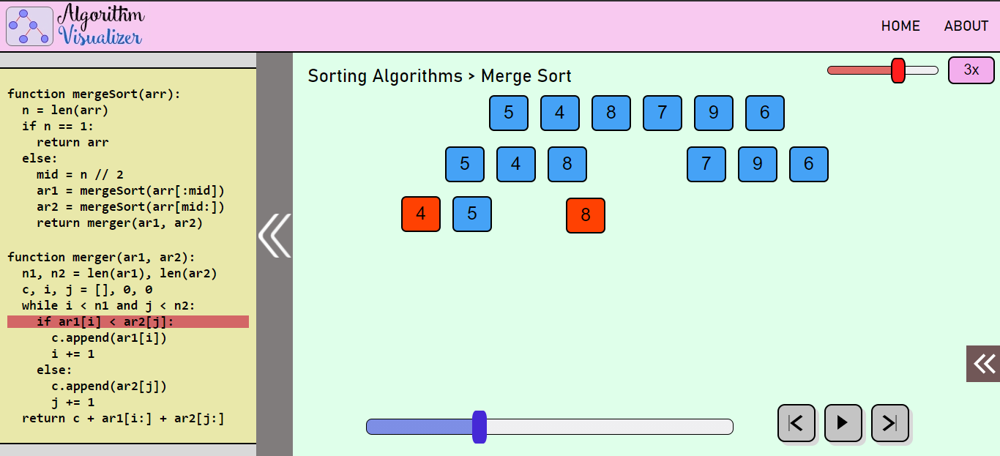
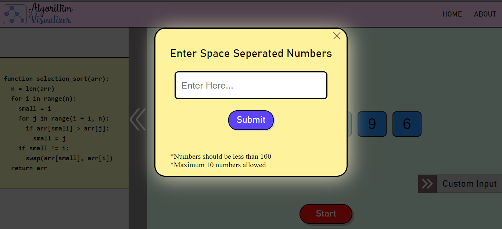
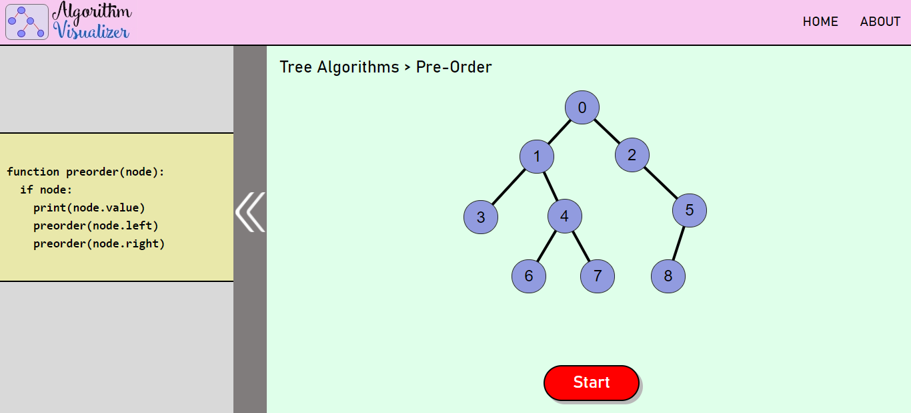
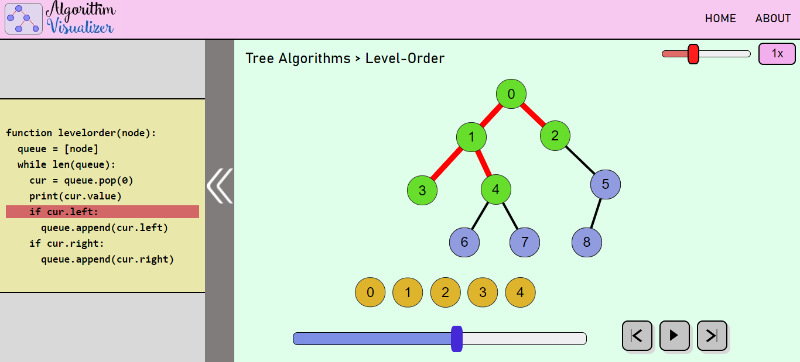
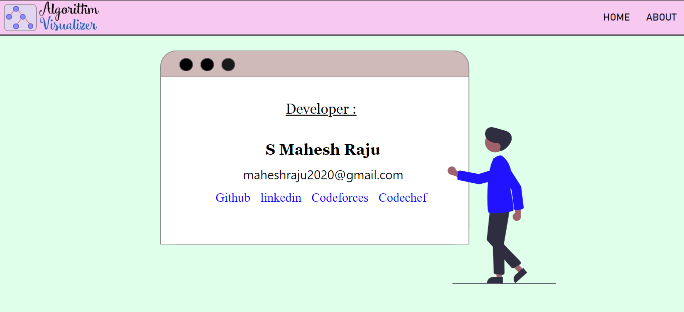

## Algorithm Visualizer

This is an interactive online platform that visualizes algorithms from code.

It showcases sorting algorithms like selection, insertion, bubble and merge sort, also tree traversal algorithms like inorder, preorder, postorder and level-order. The project aims to create a better understanding in working of the algorithms and could be used by students and teachers, as a teaching aid.

This visualizer is built using React Js (for frontend), GSAP (for animation), express (for deployment) and other common web developing tools like HTML/CSS, JavaScript, BootStrap, HTML5 Canvas etc.

Use npm install and npm start to run this visualizer on your local machine, after cloning it.

# Some Screenshots:

You can checkout the visualizer here:
https://algorithm--visualizer.herokuapp.com/
